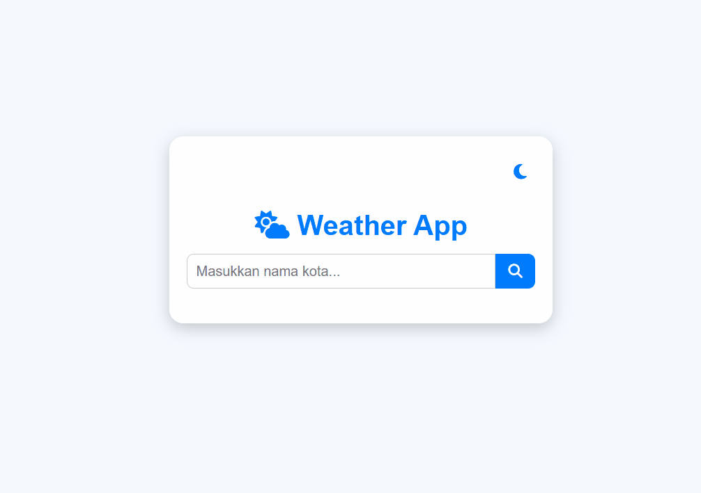

# Weather App 🌤️

A simple web-based weather application that shows real-time weather information for any city. Features **light/dark theme**, weather icons, detailed weather info, and a **Copy Info** button.



## Demo
Check the live demo here: [https://s4rt4.github.io/cuaca](https://s4rt4.github.io/cuaca)

## Features
- Search weather by city name.
- Light and dark theme toggle.
- Displays:
  - Current, maximum, and minimum temperature
  - Humidity
  - Wind speed
  - Air pressure
  - Weather description
- Weather icons according to the current condition.
- Copy weather information to clipboard.

## How to Use
1. Clone or download this repository:
   ```bash
   git clone https://github.com/s4rt4/cuaca.git
